[](LICENSE) [](https://github.com/nanoframework/Home/blob/main/CONTRIBUTING.md) [](https://discord.gg/gCyBu8T)


-----

# Welcome to the .NET **nanoFramework** nanoFramework.IoT.TestStream Library repository

The [`TestStream.Runner`](./TestStream.Runner) application is designed to manage device connections within a WSL environment, run the ADO agent. It has a feature to setup new devices and is specifically focusing on identifying new serial ports created when new hardware is connected. It handles errors gracefully and provides feedback to the user through console messages and logging.

The setup feature allows to smoothly add new devices, bind them and attach them in full transparency into WSL. Configuration files are created so that users do not have to worry about the complexity behind.

It is also design to run all the needed background applications and docker containers in full transparency.

An automatic assisted setup with a nice Terminal.Gui UI is available. You also have the ability to install everything manually with an installation script which will smoothly install of all the needed components.

> [!Important]
> This repository also contains a POC with a dummy .NET nanoFramework application, associated library and tests. The configuration of the build system present in the [multi-stage.yml](multi-stage.yaml) pipeline is here only to be able to test the overall pipelines. All the associates files like the nuspec and any other element can be ignore.
> The only important code is present in the [TestStream.Runner](./TestStream.Runner) directory.

For native Windows agent installation, see this document.

## Download and unzip the artifact

Go to the [Releases](https://github.com/nanoframework/nanoFramework.IoT.TestStream/releases) page and download the latest `TestStream.Runner.zip`. Unzip the file on your Windows machine, it will contain the executable and a folder `agent` which contains the needed scripts and configuration files.

## Automatic configuration

From **an administrator elevated prompt**, to start the automatic configuration run the application with the `-s` option:

```shell
TestStream.Runner -s
```

The application will first check that it is not running already as a scheduled task. If it's the case, it will stop it. If the application has never been installed, you'll be prompted to install it. And you have the option to start it automatcially at the end.

> [!Note]
> If you want to add more than one device, you'll need to run again the setup. So, do not check the box to run the task once finisehd.

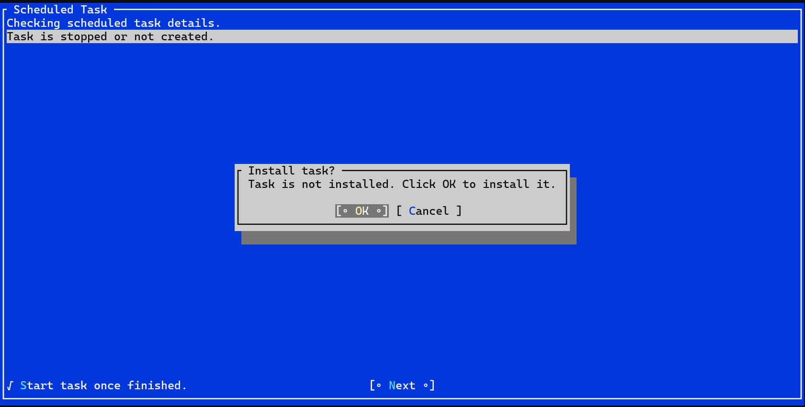

You'll know if you've been sucessfull. In case, you're not, it's most likely because you are not running this setup in an elevated prompt.

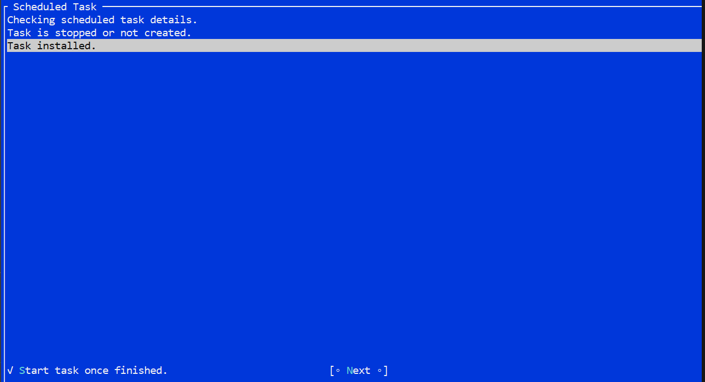

You will then be asked for the configuration. the important part is to store your PAT token allowing a connection the the nanoFramework pipelines. For the moment, the default pipeline pool is called `TestStream`, the organization is `nanoframework`. It is recommented to use you github ID in the name of the agent. Click save once done.

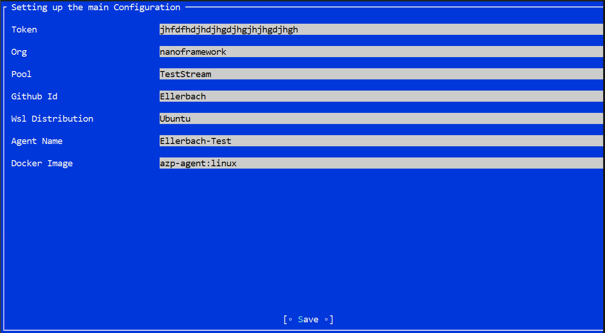

The next steps will check you have all the requirements installed likie WSL2, Docker, and USBIPD installed. Depending on what is not installed, you'll be prompted to install them. Please note that at some point a reboot may be needed. The installation script will open in a separate window as you'll have to input manual elements. Please be attentive and follow the instructions.

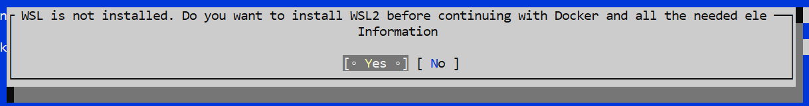

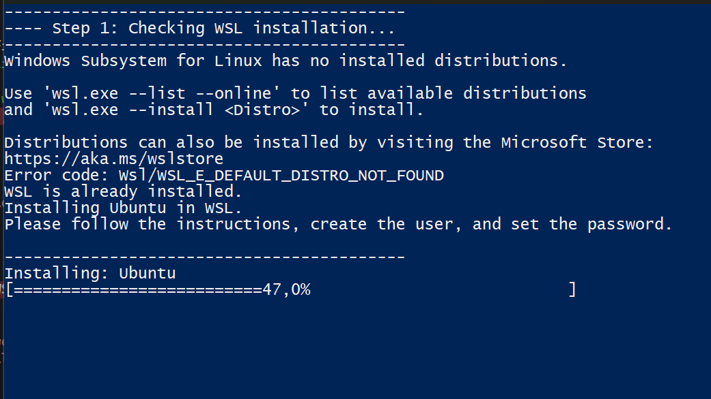

> [!Important]
> At this stage, if the distribution is not installing, a message will be displayed and ask you to reboot the machine. The application will not detect it but you'll be prompted later on.

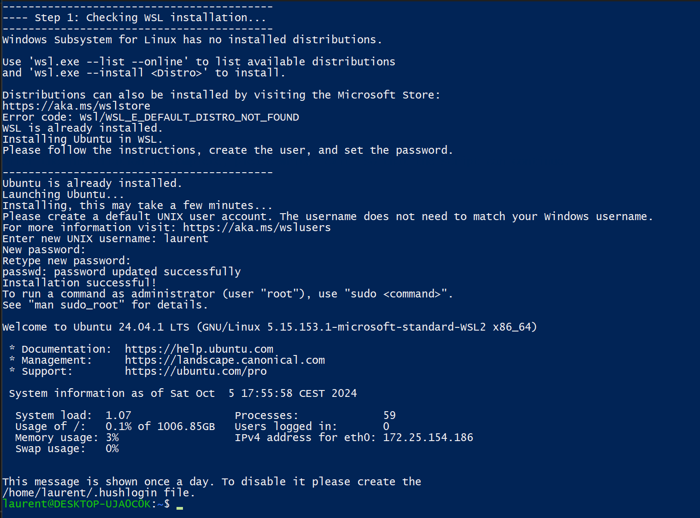

At this stage, the distribution has been installed, you've been prompted for a user name and a password. Now, type `exit` so that the setup con continue.

You will again be prompted for your password at two different occasions:

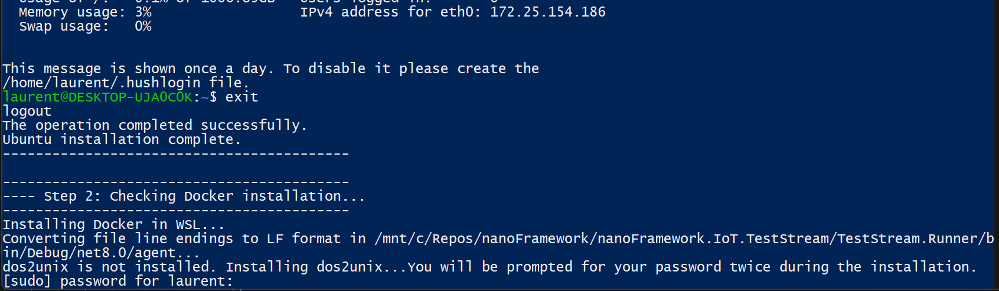

You will then be asked to type the command sudo `./agent/install/docker.ps` to install docker. One more type, your password will be asked.

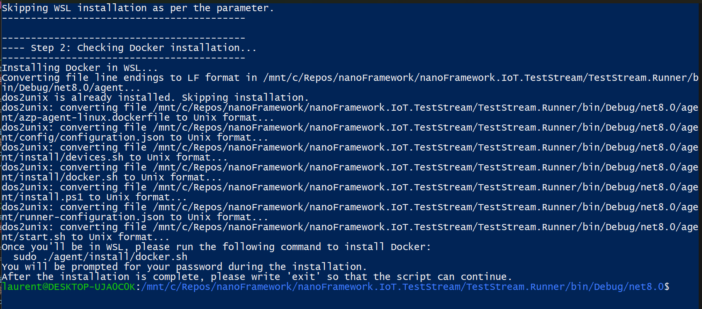

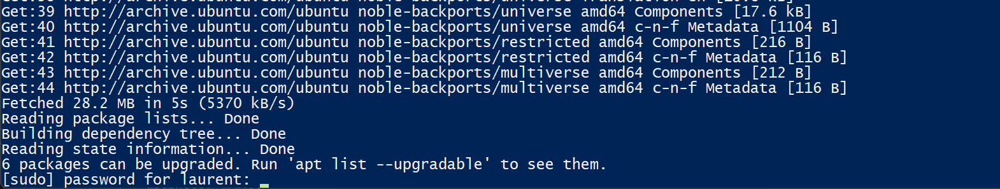

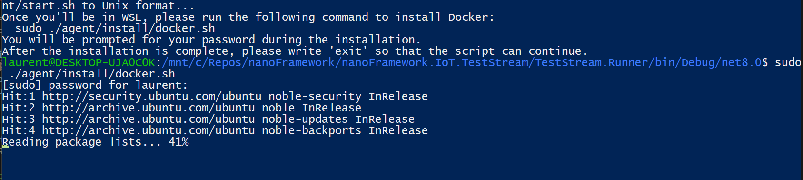

And finally, once installed, you'll have to type `exit`.

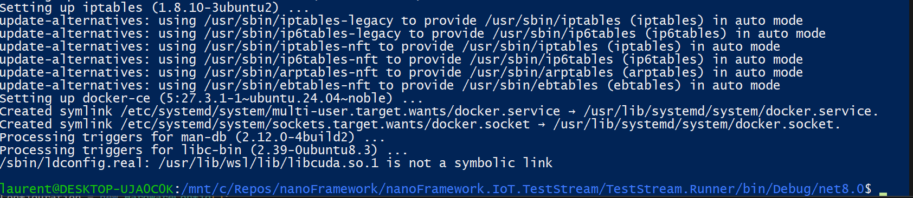

The setup will continue with the installation of USBIPD.

In case you already have an environement properly setup with WSL2 and Docker, if you are just missing USBIPD, you'll be prompted to install it:

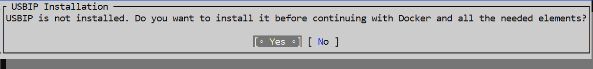

> [!Important]
> All this setup should only run once and is checked every time the application is run in setup mode. If anything is detected as missing at any time, you'll be asked to install the missing component.

THe next part is adding a device. Type the name of the firmware you want to use on your device. Please look at the [nf-interpreter](https://github.com/nanoframework/nf-interpreter) to find the exact names.

> [!Important]
> Do not plug the device before being asked.
>
> Make sure you don't have Device Explorer open or anything that will open the serial port of your device.

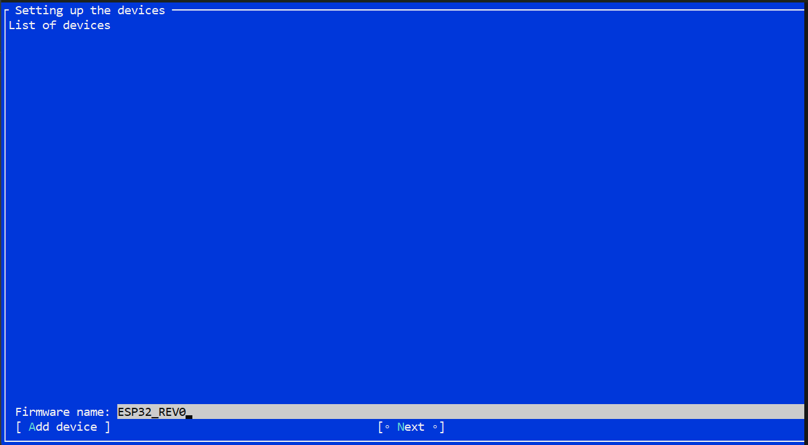

Once you'll click `Add device`, you'll be prompted to plug your device.

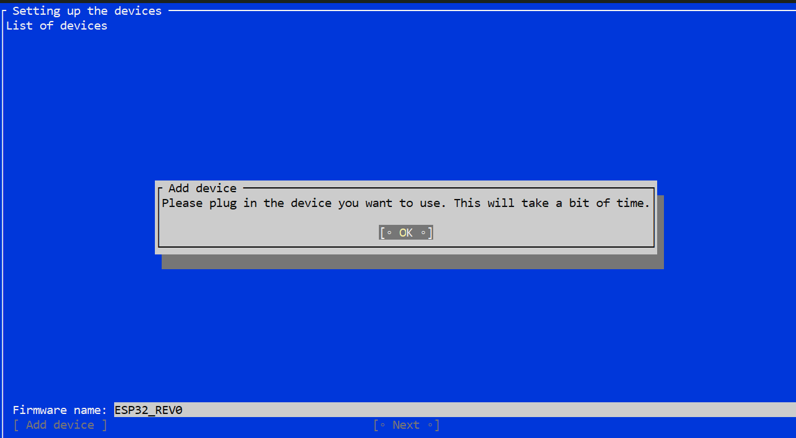

Then a series of tests, setup and check will be done. This will take a minute or so.

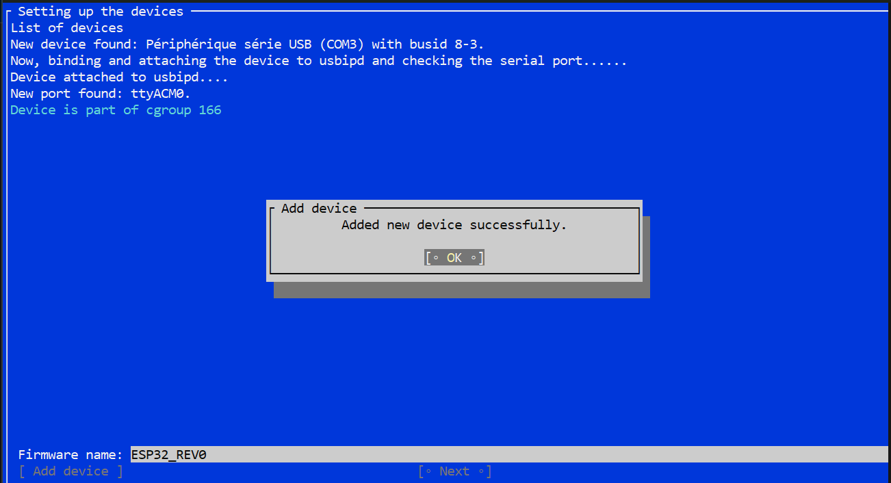

Click `Next` and the Docker image will be checked. If it does not exist, it will be built automatically.

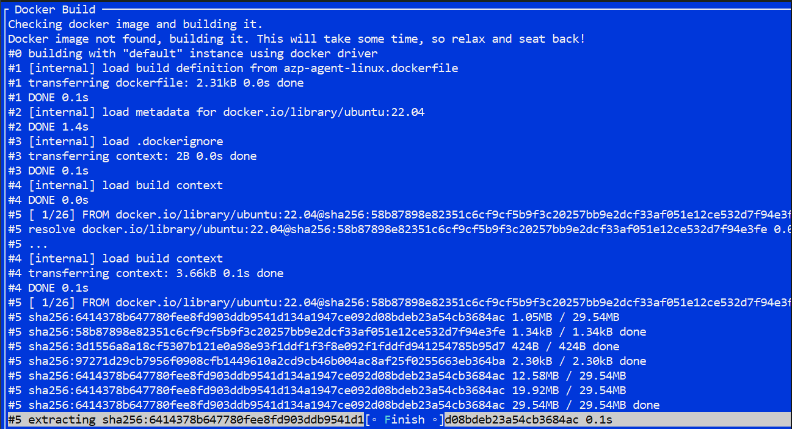

Once done or if the image is already built, you'll be able to click `Finish`.

**Congratulations**, you've setup everything properly. To add a new device, please run again the application in setup mode.

If you've selected to start the task automatically, you'll see a new prompt starting. It will try to connect to the Azure Dev Ops Agent pipeline and also advertize as capacities the devices you have setup.

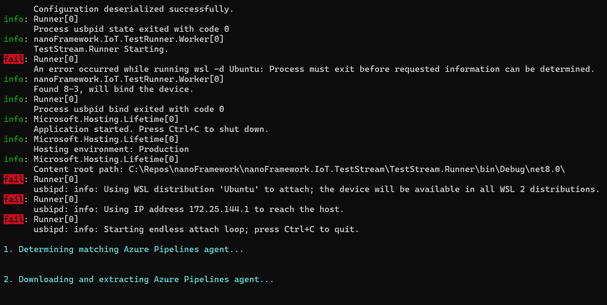

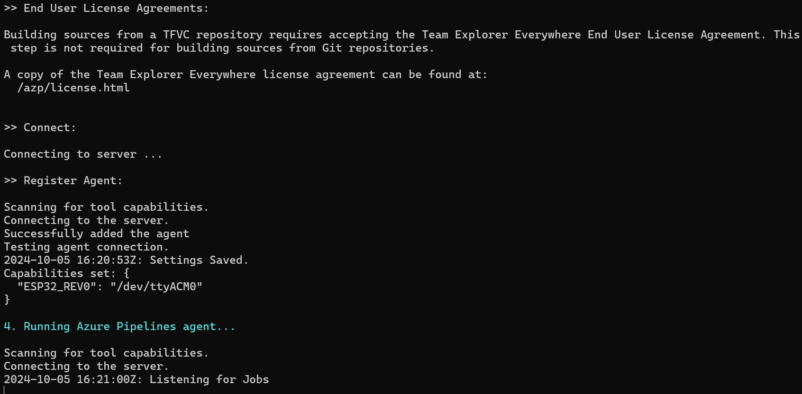

The agent is then visible in ADO:

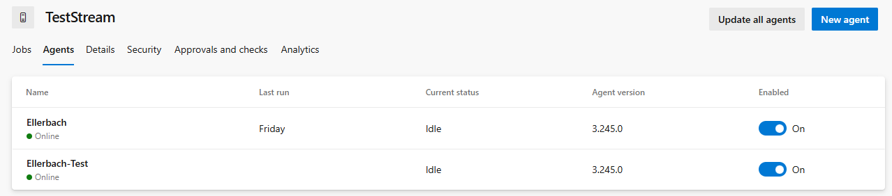

## Manual installation of requirements

This application is targeting Windows 10+ with WSL2 for x64 processors. You then need to have a machine that will allow virtualization.

Clone the repository and go to the [/agent](./agent/) folder and run the [install.ps1](./agent/install.ps1) script. The script **must** run in an elevated privilege PowerShell (Run as administrator).

Parameters are available to allow skipping some of the installations:

* `SkipWSLInstallation` will skip the WSL installation.
* `SkipDockerInstallation` will skip the docker installation in WSL.
* `SkipUSBIPDInstallation` will skip the USBIOD installation on Windows.
* `WSLDistribution` allows you to setup a default WSL name for the installation. The default nam will be "Ubuntu".

Note that an Ubuntu based image is require for this installation script. If you wish to use another distribution, you will have to install docker in it. The rest will work the same way.

### Configuration files

2 configurations files are require:

* A TestStream.Runner configuration file that will be used to setup the devices, the mounting volumes in WSL, the token to connect the agent and the agent configuration. This file is mandatory and needs to contain valid information in its config section. An [example is provided](./agent/runner-configuration.json).
* An agent capabilities configuration file that will be used by the agent to shows its capabilities. This file can be generated during the initial setup.

> [!Important]
> The 2 configuration files cannot be in the same directory for security reasons. It is recommended to place the agent configuration file in a separate directory with no other files. [See the example](./agent/config).

### Setting up new devices

Run the TestStream.Runner with the following arguments in an elevated privilege prompt (Run as administrator):

```shell
TestStream.Runner -d path_to\runner-config.json -h path_to\config\configuration.json -s
```

You will be prompted to plug your device. The setup will takes couple of seconds. You will be prompt for the device firmware. Please refer to [nf-interpreter](https://github.com/nanoframework/nf-interpreter) for the list of firmware.

The TestStream.Runner configuration file will be updated and the agent configuration will be appended. It is indeed possible to have multiple firmware sharing the same serial port. So, please adjust manually the agent configuration file if needed.

Run as many times as you need to add different hardware or firmware the setup.

## Running TestStream.Runner

Run the TestStream.Runner with the following arguments in an elevated privilege prompt (Run as administrator):

To use the default configuration paths:

```shell
TestStream.Runner
```

To specify your own configuration files:

```shell
TestStream.Runner -d path_to\runner-config.json -h path_to\config\configuration.json
```

The application will bind and attach the devices into WSL, run the docker container with the proper settings. In case a device is deattached, it will automatically reattach it.

> [!Important]
> In the current state of the application, no restart will be provided in case the container stops or WSL stops.

## Maintainer documentation

Please [check this page](./maintainer.md) for maintainer documentation and details.

## Missing elements

[ ] Create a robust error handling to restart the container, WSL or any other element when needed.
