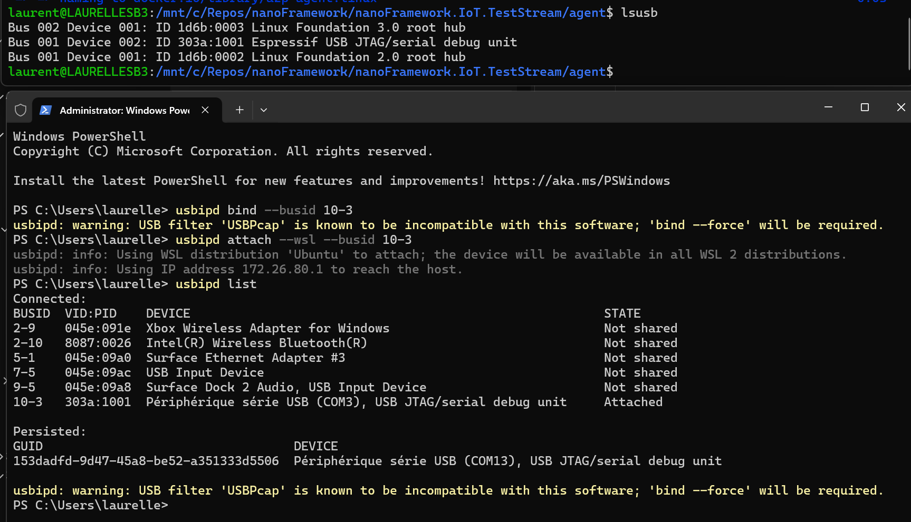
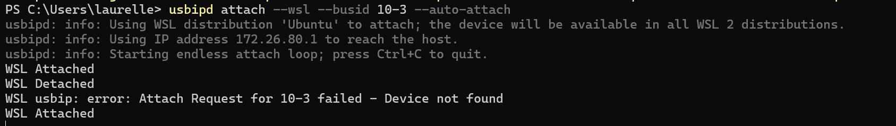

# Setup for the agent

If you want to setup the requirements to run all the system, please run the `install.ps1` powershell and follow the instructions. If you have already WSL setup, docker and usbipd, you can skip those individual installations by using the appropriate flags.

## What needs to be installed in the image

Dockerfile should contain:

* mono-complete to be able to run the tests.
* dotnet SDK 8.0 to be able to run and install nanoff.
* VSTest from Visual Studio from the latest nuget to run the test. This cannot be installed as a task because it does only support Windows and Visual Studio. This is where mono plays.
* powershell so that script can run.
* nanoff tool to flash the device.

TODO: adjust all the path, move the VS Test exe up and in a clean directory undo /azp/tools

## USB access with WSL2

To be able to access serial ports to flash and run the tests, it is needed to install, after setting up properly WSL2, [USBIPD-WIN](https://learn.microsoft.com/en-us/windows/wsl/connect-usb).

Just follow the instructions and make sure you are using the very latest WSL2 kernel by running `wsl --update` **before** the installation of USBIP. [Current verion here](https://github.com/dorssel/usbipd-win/releases/download/v4.3.0/usbipd-win_4.3.0.msi).

You will need then to attach properly in WSL the vendor ID and product ID associated to your compatible .NET nanoFramework device.



In short, you'll need first to list the devices to find the USB bus id which will look like `x-y` where x and y are numbers then bind and attach it. So, running from an **elevated administrator prompt on Windows**:

* `usbipd list` and find your USB device.
* `usbipd bind --busid x-y` where x-y is the bus id you'll find in the list.
* `usbipd attach --wsl --busid x-y` where x-y is the same as before.

If you list again, you'll see that your device is now "Attached" compare to "Not shared" initially.

> [!Important]
> When you unplug and replug the device, it is **not** attached anymore but on a "Shared" state meaning, you have to rerun the attach command to share it again. You need to add `--auto-attach` in the attach command line. But this is a blocking process. So it's definitely something you should run on the background.



TODO: create a script to run it always or add it as a service or something equivalent. Can be done also when running the container with a Windows script using the `wsl -e` trick and an execution of the auto attach in a parallel thread.

## Building the agent container

The agent container should be built before running it.

```shell
docker build -t azp-agent:linux -f ./azp-agent-linux.dockerfile .
```

TODO: have it available in GitHub container registry like for the nf-interpreter DevContainers.

## Accessing serial port from the container

Hardware access can be challenging in a dev container. For this, the user under which the container is running (root in a case of docker or the current user in the case of podman) should have access to the hardware. It's mainly about adding the user to the group.

Create a file named /etc/udev/rules.d/99-serial.rules. Add the following line to that file:

```shell
KERNEL=="ttyACM[0-9]*",MODE="0666"
KERNEL=="ttyUSB[0-9]*",MODE="0666"
```

You will need then to exit WSL and restart WSL byt running the command `wsl --shutdown` and then again `wsl` to reenter it.

Then, in the container, a volume pointing out on the hardware needs to to be set **and** the device cgroup rule needs to be adjusted.

As an example, the serial port from the previous example is mapped on `/dev/ttyACM0` or `/dev/ttyUSB0`. Running the following command will show in which group the port is and the type of access:

```shell
> ls -al /dev/* | grep ttyACM
crw-rw-rw- 1 root dialout 166,   0 Sep 10 10:58 /dev/ttyACM0
```

In that case, the group is 166 and the access is already granted. It means that we can pass the following arguments to the container to make sure the access will work: `--device-cgroup-rule='c 166:* rmw' -v /dev/ttyACM0:/dev/ttyACM0`.

In the case the root user or the current user depending on the container engine you are running, you may have to add a rule. [See this thread](https://stackoverflow.com/questions/24225647/docker-a-way-to-give-access-to-a-host-usb-or-serial-device) and jump to the summary to understand what needs to be done.

To export multiple ports, just add more rules and more volume mount.

### Running the agent container

This is how to run the agent container previously built passing the needed elements.

```shell
docker run -e AZP_URL="https://dev.azure.com/nanoframework" -e AZP_TOKEN="supersecrettoken" -e AZP_POOL="TestStream" -e AZP_AGENT_NAME="Docker Agent - Linux" --device-cgroup-rule='c 166:* rmw' -v /dev/ttyACM0:/dev/ttyACM0 -v ./config:/azp/config azp-agent:linux
```

Note that if for debug reasons you want to access the container, you can add `-it --entrypoint /bin/bash` right after the `run`.

See the [configuration](#configuration-file) section for mounting the config folder.

TODO: add this in a script or equivalent, mount the drivers and the groups automatically based on a json config file.

## Capabilities

The best way to add capabilities is by adjusting the `start.sh` script to add the capabilities. So, way of thinking is in a config file that will contains the capabilities.

TODO: work on best way to describe capabilities. They should contains the exact firmware that is supported and which is going to be tested and also sensors/nuget. There are quite some simplification to start with and it can be simpler.

## Configuration file

So far, the thinking is to have a json file containing all the configuration. This json file will be placed in a mounted directory with the launching script (on Windows). This file will be able to be created by the user based on the serial port configurations to expose, the hardware type (or firmware type).

This prototype is how it could look like:

```json
{
    "$version": 1.0,
    "hardware": [
        { "firmware":"ESP32_GenericDisplay_REV0",
          "port":"/dev/ttyACM0",
          "cgroup":166 },
        { "firmware":"ESP32_REV0",
          "port":"/dev/ttyACM0",
          "cgroup":166 },
        { "firmware":"ESP32_PSRAM_REV3_IPV6",
          "port":"/dev/ttyACM1",
          "cgroup":166 }
    ],
    "capabilities": [
        {"screen":"ILI9341_240x320_SPI"},
        {"AD5328":"true"},
    ],
    "config": {
        "token":"supersecrettoken",
        "org":"nanoframework",
        "pool":"TestStream"
    }
}
```

> [!Note]
> It should be possible to specify multiple times the same port used by different firmware.

In a bash script, it's easy to use [jq](https://jqlang.github.io/jq/) to parse json and it's already installed as the start agent script use it.

In order to mount properly the configuration file, you need to add `-v ./config:/azp/config` to the docker run command. This assumes you are running docker from the parent folder of the configuration file.

## Resources

Couple of good resources to read:

* [Hardware access in a dev container in a secured way](https://stackoverflow.com/questions/24225647/docker-a-way-to-give-access-to-a-host-usb-or-serial-device). Jump to the summary at the end.
* [USBIPD](https://github.com/dorssel/usbipd-win/tree/v4.3.0).
* [Adding Agent Capabilities](https://stackoverflow.com/questions/54700536/automate-adding-capabilities-to-azure-devops-self-hosted-agents) and also [this one in PowerShell](https://blogs.blackmarble.co.uk/rfennell/programmatically-adding-user-capabilities-to-azure-devops-agents/).
* [ADO REST API](https://learn.microsoft.com/en-us/rest/api/azure/devops/?view=azure-devops-rest-7.2).
* [ADO agent source code](https://github.com/microsoft/azure-pipelines-agent).
* [Good thread on hardware setup in WSL](https://github.com/microsoft/WSL/issues/7686).
