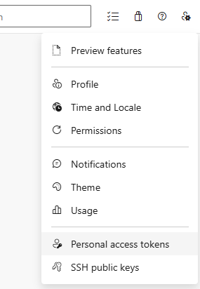
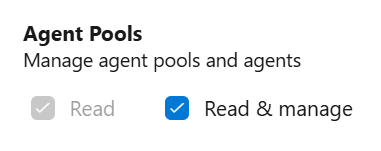
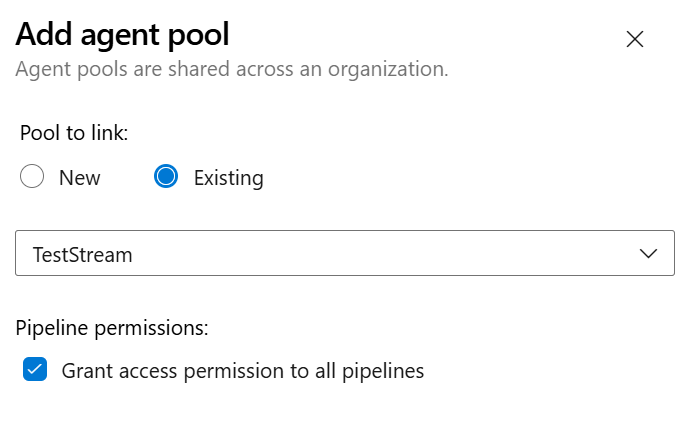

# Maintainer documentation for TestStream.Runner and pipeline setup

This documentation is intended for maintainer to manage releases, setup pipelines and create PAT token for the users.

## Creating a new release

On PR on TestStream.Runner, only a build is done. This does allow flexibility to only create a release when the changes are not on documentation, on the nanoFramework PoC application or to have multiple PR merged before.

To create a release, go to [Actions](https://github.com/nanoframework/nanoFramework.IoT.TestStream/actions/workflows/build-and-publish.yml) and run the `Build, Version, and Publish TestStream.Runner` action. This will build the application a a single file, package the needed configuration files and setup scripts, create a changelog and set a version.

## Creating a PAT token for contributors

To avoid having to add every contributor who are willing to give some of their compute power to run hardware tests, an automatic mechanism with an Azure function will be built. In the mean time, PAT token can be created manually for a period that will be agreed with the contributor.

Manual steps:

* Go to <https://dev.azure.com/nanoframework/> then connect with the account you want to create the PAT token
* Click on the `user settings` to right



* Select `Personal access tokens`
* Click the top right button `New token`
* Click on the bottom `Show all scopes`
* Select `Read & manage` in `Agent Pools`



* Give then name of the contributor to the token
* Select a proper duration
* Click `Create`

> [!Important]
> Make sure on the next screen, you copy the PAT token. Please communicate it in a secure way to the contributor with the expiration date.

## MAster PAT token for pipeline

A master PAT token needs to be creacted and rotated as per policy. It should be added to the overall organization and named `AZURE_DEVOPS_PAT`. the scope should include:

* Agent Pools: Read
* Builds: Read & Execute
* Pipeline resources: Use & Manage

## Setting up the TestStream pipeline in ADO

You need to add the specific pool `TestStream` to any ADO project where you want to run the hardware tests.

* Select the ADO project
* Go to `Project settings` on the bottom left
* Select `Agent pools`
* Click `Add pool` button on top right
* Select `Existing`, in the drop down select `TestStream`, click `Grant access`



* Click `Create`

## Adjusting an existing ADO yml file to add hardware support

Adjusting an existing ADO yml file to add the hardware tests is about transforming the existing pipeline into a multi stage pipeline and adding the test template. An example is in the [multi-stage.yaml](./multi-stage.yaml) file.

Remove the trigger part and replace with, remove the cancel part as well:

```yaml
# The Pipeline is going to be called by the GitHub action.
# Manual trigger is always possible.
trigger: none
pr: none
```

Add the folling block after the `resources` entry:

```yml
parameters:
- name: appComponents
  displayName: List of capabilities to run the tests on
  type: object
  default:
    - none
```

> [!Important]
> List all the firmware that are present in existing self hosted agents.

This will be adjusted with a git action later to browse existing agents and gather this information. So far, it's a manual gathering.

Transform the pool into a multi stage, don't forget to indent everything else in the yaml file:

```yml
stages:
- stage: Build
  displayName: 'Build'
  jobs:
  - job: Build
    displayName: 'Build job'
    pool:
      # default is the following VM Image
      vmImage: 'windows-latest'
```

Add a task at the end of your pipeline:

```yml
    - task: PublishPipelineArtifact@1
      displayName: Publish Pipeline Artifact copy
      inputs:
        path: '$(System.DefaultWorkingDirectory)'
        artifactName: 'Artifacts'
```

This will publish all the built elements into the Azure artifact so that, the hardware tests will grab it to run them.

Add then this block at the very end, it will create multi stages that depends on the build and will run the hardware tests:

```yml
- ${{ each appComponents in parameters.appComponents }}:   
  - template: azure-pipelines-templates/device-test.yml@templates
    parameters:
      appComponents: ${{ appComponents }}
      unitTestRunsettings: 
        - 'UnitTestStream/nano.runsettings,UnitTestStream/bin/Release/NFUnitTest.dll'
```

> [!Important]
> You have to list all the tests you want to run with each individual tests you want to run. Each line is a specific dll, separate the runsetting with the built dll with a coma.

## Creating a new ADO pipeline to trigger the pipeline

You will have to add a new ADO pipeline. You can name the file `azure-bootstrap.yml`. And place the following content:

```yaml
# Copyright (c) .NET Foundation and Contributors
# See LICENSE file in the project root for full license information.

trigger:
  branches:
    include:
      - main
      - develop
      - release-*
  paths:
    exclude:
      - .github_changelog_generator
      - .gitignore
      - CHANGELOG.md
      - CODE_OF_CONDUCT.md
      - LICENSE.md
      - README.md
      - NuGet.Config
      - assets/*
      - config/*
      - .github/*

# PR always trigger build
pr:
  autoCancel: true

jobs:
- job: Trigger
  displayName: Trigger Azure Dev Ops build and test pipeline
  pool:
    vmImage: 'ubuntu-latest'

  variables:
    AZURE_DEVOPS_ORG: nanoFramework
    AZURE_DEVOPS_PROJECT: nanoFramework.IoT.TestStream
    AZURE_DEVOPS_PIPELINE_ID: 111
    AZURE_POOL_NAME: TestStream    

  steps:   
  - script: |
      # Validate required environment variables
      for var in AZURE_DEVOPS_ORG AZURE_DEVOPS_PROJECT AZURE_DEVOPS_PIPELINE_ID AZURE_POOL_NAME; do
          if [ -z "${!var}" ]; then
              echo "Error: Required environment variable $var is not set"
              exit 1
          fi
      done

      # Define the Azure DevOps organization, project, and pipeline
      organization="${AZURE_DEVOPS_ORG}"
      project="${AZURE_DEVOPS_PROJECT}"
      pipelineId="${AZURE_DEVOPS_PIPELINE_ID}"
      poolName="${AZURE_POOL_NAME}"
      branch="${BUILD_SOURCEBRANCH}"

      # Encode the PAT
      patEncoded=$(echo -n ":${AZURE_DEVOPS_PAT}" | base64)

      # Define the headers
      headers=(
        -H "Authorization: Basic $patEncoded"
        -H "Content-Type: application/json"
      )

      # Get the pool ID
      url="https://dev.azure.com/${organization}/_apis/distributedtask/pools?poolName=${poolName}&api-version=7.1"
      AZP_POOL_AGENTS=$(curl -s "${headers[@]}" -X GET "$url")
      poolId=$(echo "$AZP_POOL_AGENTS" | jq -r '.value[0].id')

      echo "Pool ID: $poolId"

      # Define the URL to get all agents in the pool
      url="https://dev.azure.com/${organization}/_apis/distributedtask/pools/${poolId}/agents?includeCapabilities=true&api-version=7.1"

      response=$(curl -s -w "%{http_code}" "${headers[@]}" -X GET "$url")
      http_code=${response: -3}
      content=${response::-3}

      if [ $http_code -eq 200 ]; then
          # Extract all userCapabilities names for online and enabled agents as a unique list
          capabilityNames=$(echo "$content" | jq -r '[.value[] | select(.status == "online" and .enabled == true) | .userCapabilities | keys] | unique | flatten | join("\n- ")')
      else
          echo "Failed to retrieve agent capabilities. HTTP Status Code: $http_code"
          echo "Response: \"$content\""
          exit 1
      fi
      echo "Unique userCapabilities names: \"$capabilityNames\""

      # Prepare the parameters
      parametersJson=$(jq -n --arg appComponents "- $capabilityNames" '{templateParameters: {appComponents: $appComponents}}')

      echo "Parameters: \"$parametersJson\""
      echo "Branch for PR: \"$branch\""

      # Define the request body
      bodyJson=$(jq -n --argjson parameters "$parametersJson" --arg branch "$branch" '{
        resources: {
          repositories:               
            {
              self: {
                refName: $branch
              }
            }
        },
        templateParameters: $parameters.templateParameters
      }')

      echo "Request body: \"$bodyJson\""

      # Define the URL
      url="https://dev.azure.com/${organization}/${project}/_apis/pipelines/${pipelineId}/runs?api-version=7.1"

      # Trigger the pipeline
      response=$(curl -s -w "%{http_code}" "${headers[@]}" -X POST -d "$bodyJson" "$url")
      http_code=${response: -3}
      content=${response::-3}

      if [ $http_code -eq 200 ]; then
          run_id=$(echo "$content" | jq -r '.id')
          echo "Pipeline triggered successfully. Run ID: $run_id"
          echo "##vso[task.setvariable variable=run_id]$run_id"
      else
          echo "Failed to trigger pipeline. HTTP Status Code: $http_code"
          echo "Response: $content"
          exit 1
      fi
    displayName: 'Trigger Azure DevOps Pipeline'
    env:        
      BUILD_SOURCEBRANCH: $(Build.SourceBranch)
      AZURE_DEVOPS_PAT: $(AZURE_DEVOPS_PAT)
  
  - script: |
      echo "Pipeline to monitor Run ID: $(run_id)"
      # Define the URL to get the pipeline run status
      url="https://dev.azure.com/${AZURE_DEVOPS_ORG}/${AZURE_DEVOPS_PROJECT}/_apis/pipelines/${AZURE_DEVOPS_PIPELINE_ID}/runs/$(run_id)?api-version=7.1"

      # Loop to monitor the pipeline run status
      while true; do
          response=$(curl -s -w "%{http_code}" -H "Authorization: Basic $(echo -n ":${AZURE_DEVOPS_PAT}" | base64)" -X GET "$url")
          http_code=${response: -3}
          content=${response::-3}

          if [ $http_code -eq 200 ]; then
              state=$(echo "$content" | jq -r '.state')
              result=$(echo "$content" | jq -r '.result')

              echo "Pipeline run state: $state"

              if [ "$state" == "completed" ]; then
                  echo "Pipeline run completed with result: $result"
                  if [ "$result" == "succeeded" ]; then
                      exit 0
                  else
                      exit 1
                  fi
              fi
          else
              echo "Failed to get pipeline run status. HTTP Status Code: $http_code"
              echo "Response: $content"
              exit 1
          fi

          # Wait for a while before checking again
          sleep 30
      done
    displayName: 'Monitoring Azure DevOps pipeline'
    env:
      run_id: $(run_id)
      AZURE_DEVOPS_PAT: $(AZURE_DEVOPS_PAT)
```

You will have to adjust the following to match the ADO project name and pipeline ID:

```yaml
        AZURE_DEVOPS_PROJECT: nanoFramework.IoT.TestStream
        AZURE_DEVOPS_PIPELINE_ID: 111
```

> [!Important]
> You **must** add a secret with the PAT token to the ADO pipeline. Make sure to check that it is a **secret**.
