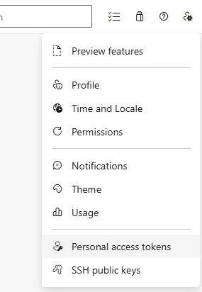
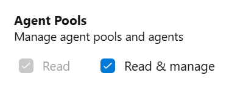
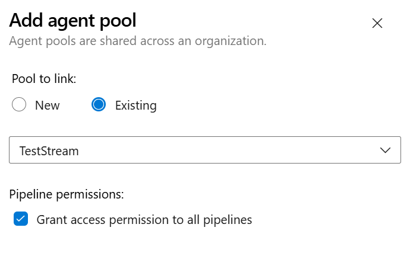

# Maintainer documentation for TestStream.Runner and pipeline setup

This documentation is intended for maintainers to manage releases, set up pipelines, and create PAT tokens for users.

## Creating a new release

On a PR on TestStream.Runner, only a build is done. This allows flexibility to create a release only when changes are not in documentation or in the nanoFramework PoC application, or to have multiple PRs merged before.

To create a release, go to [Actions](https://github.com/nanoframework/nanoFramework.IoT.TestStream/actions/workflows/build-and-publish.yml) and run the `Build, Version, and Publish TestStream.Runner` action. This will build the application as a single file, package the needed configuration files and setup scripts, create a changelog, and set a version.

## Creating a PAT token for contributors

To avoid having to add every contributor who is willing to give some of their compute power to run hardware tests, an automatic mechanism with an Azure function will be built. In the meantime, PAT tokens can be created manually for a period that will be agreed with the contributor.

Manual steps:

* Go to <https://dev.azure.com/nanoframework/>, then connect with the account you want to use to create the PAT token.
* Click on `User settings` on the right.



* Select `Personal access tokens`.
* Click the top-right button `New token`.
* Click `Show all scopes` at the bottom.
* Select `Read & manage` in `Agent Pools`.



* Give the contributor's name to the token.
* Select a proper duration.
* Click `Create`.

> [!Important]
> Make sure on the next screen you copy the PAT token. Please communicate it securely to the contributor, along with the expiration date.

## Master PAT token for pipeline

A master PAT token needs to be created and rotated as per policy. It should be added to the overall organization and named `AZURE_DEVOPS_PAT`. The scope should include:

* Agent Pools: Read
* Builds: Read & Execute
* Pipeline resources: Use & Manage

## Setting up the TestStream pipeline in ADO

You need to add the specific pool `TestStream` to any ADO project where you want to run hardware tests.

* Select the ADO project
* Go to `Project settings` on the bottom left
* Select `Agent pools`
* Click `Add pool` button on top right
* Select `Existing`, in the drop-down select `TestStream`, then click `Grant access`.



* Click `Create`

## Adjusting an existing ADO yml file to add hardware support

Adjusting an existing ADO yml file to add hardware tests is about transforming the existing pipeline into a multi-stage pipeline and adding the test template. An example is in the [multi-stage.yaml](./multi-stage.yaml) file.

Remove the trigger part and replace it with the following, and remove the cancel part as well:

```yaml
# The Pipeline is going to be called by the GitHub action.
# Manual trigger is always possible.
trigger: none
pr: none
```

Add the following block after the `resources` entry:

```yml
parameters:
- name: appComponents
  displayName: List of capabilities to run the tests on
  type: object
  default:
    - none
```

> [!Important]
> List all the firmware that are present in existing self hosted agents.

This will be adjusted with a GitHub Action later to browse existing agents and gather this information. So far, it's a manual process.

Transform the pool into a multi-stage pipeline, and don't forget to indent everything else in the yaml file:

```yml
stages:
- stage: Build
  displayName: 'Build'
  jobs:
  - job: Build
    displayName: 'Build job'
    pool:
      # default is the following VM Image
      vmImage: 'windows-latest'
```

Add a task at the end of your pipeline:

```yml
    - task: PublishPipelineArtifact@1
      displayName: Publish Pipeline Artifact copy
      inputs:
        path: '$(System.DefaultWorkingDirectory)'
        artifactName: 'Artifacts'
```

This will publish all the built elements into the Azure artifact so that the hardware tests can grab them to run.

Then add this block at the very end. It will create multiple stages that depend on the build and run the hardware tests:

```yml
- ${{ each appComponents in parameters.appComponents }}:   
  - template: azure-pipelines-templates/device-test.yml@templates
    parameters:
      appComponents: ${{ appComponents }}
      unitTestRunsettings: 
        - 'UnitTestStream/nano.runsettings,UnitTestStream/bin/Release/NFUnitTest.dll'
```

> [!Important]
> You have to list all the tests you want to run, with each individual test you want to run. Each line is a specific dll; separate the runsettings from the built dll with a comma.

## Creating a new ADO pipeline to trigger the pipeline

You will have to add a new ADO pipeline. You can name the file `azure-bootstrap.yml`, and place the following content:

```yaml
# Copyright (c) .NET Foundation and Contributors
# See LICENSE file in the project root for full license information.

trigger:
  branches:
    include:
      - main
      - develop
      - release-*
  paths:
    exclude:
      - .github_changelog_generator
      - .gitignore
      - CHANGELOG.md
      - CODE_OF_CONDUCT.md
      - LICENSE.md
      - README.md
      - NuGet.Config
      - assets/*
      - config/*
      - .github/*

# PR always trigger build
pr:
  autoCancel: true

jobs:
- job: Trigger
  displayName: Trigger Azure Dev Ops build and test pipeline
  pool:
    vmImage: 'ubuntu-latest'

  steps:
  - template: azure-pipelines-templates/device-bootstrap.yml@templates
    parameters:
      AZURE_DEVOPS_PROJECT: nanoFramework.IoT.TestStream
      AZURE_DEVOPS_PIPELINE_ID: 111
```

You will have to adjust the following to match the ADO project name and pipeline ID:

```yaml
      AZURE_DEVOPS_PROJECT: nanoFramework.IoT.TestStream
      AZURE_DEVOPS_PIPELINE_ID: 111
```

> [!Important]
> You **must** add a secret with the PAT token to the ADO pipeline. Make sure to check that it is a **secret**.
