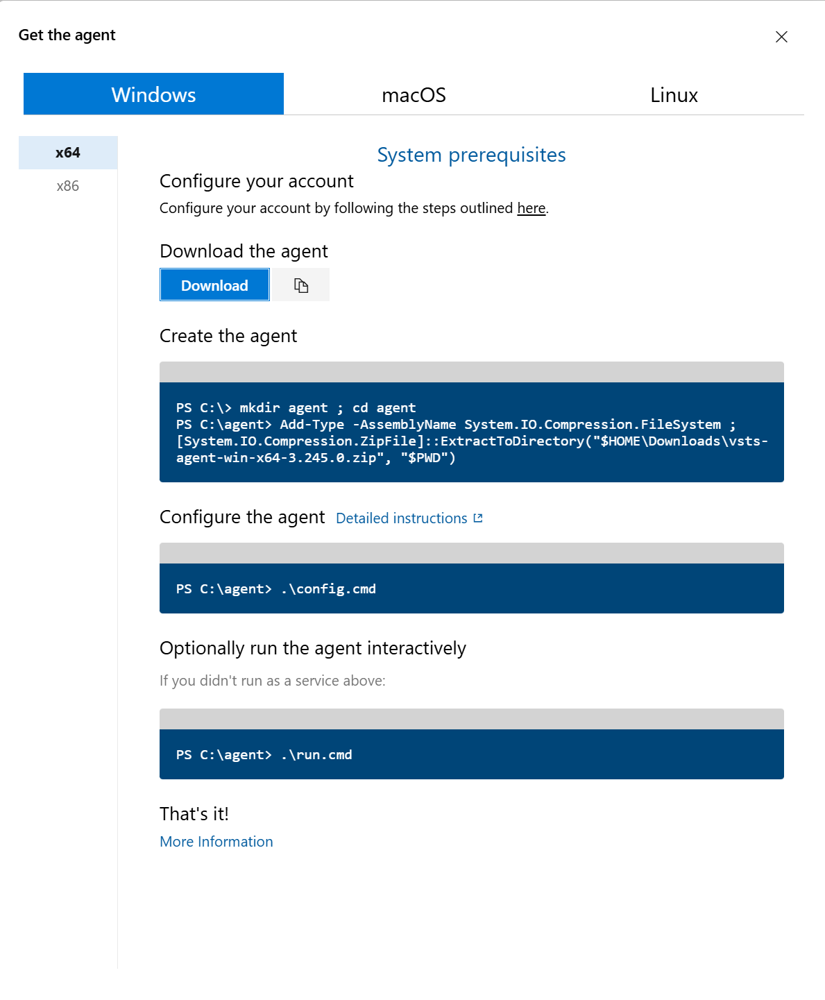

# Native agent installation

Follow the instruction that will looks like this:

You will be prompted for:

* the serveur URL: `https://dev.azure.com/nanoframework`
* the authentication, use the default PAT
* paste your PAT token when asked
* the agent poolo is: `TestStream`
* use the default `_work` directory
* select if you want or not install the agent as a service or not
