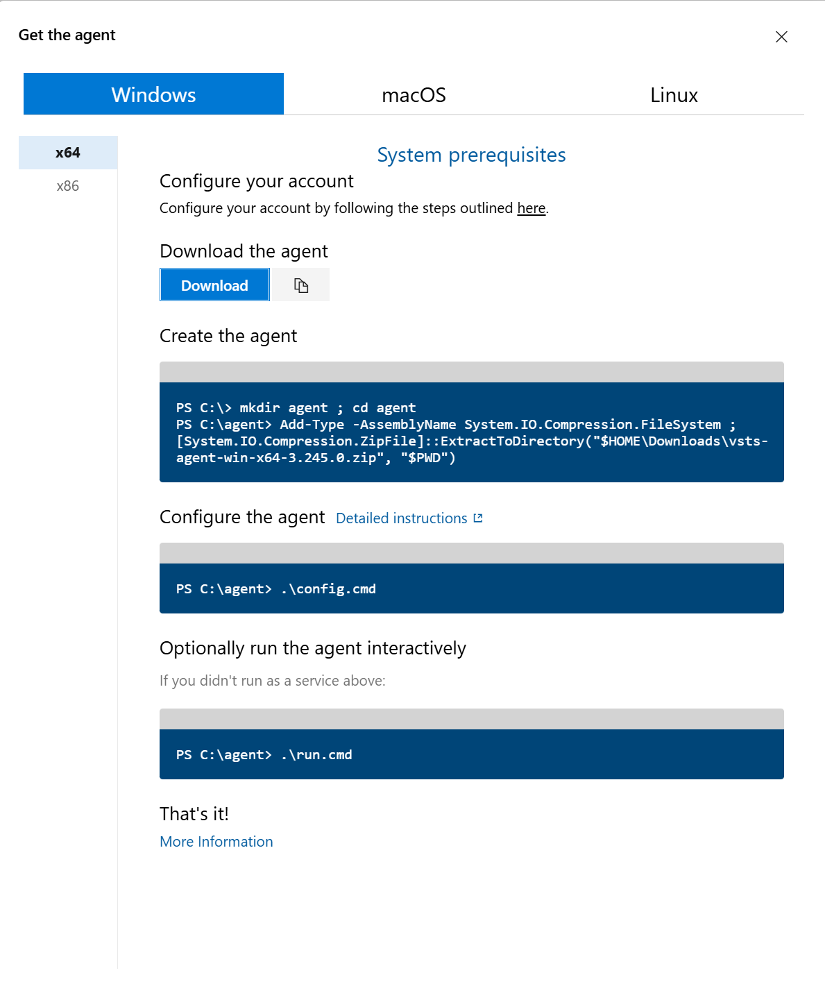

# Native agent installation

## Pre requirements

Before attempting a first install, you will first need to install these dependencies on your PC:

* [.NET 8.0](https://dotnet.microsoft.com/en-us/download).
* [.NET Framework 4.8](https://dotnet.microsoft.com/en-us/download/dotnet-framework/net48).
* Optional windows updates and/or manual install serial port drivers for your nanoframework compatible device(s).

> [!Important]
> It is reccomended that you move the `agent` folder to the root of the filesystem.


## Agent installation

Follow the instruction that will looks like this:



By default, the agent will advertise almost all your environement variables including the name of the user, some key directories, and many many other elements. You can get rid of this by setting up the VSO_AGENT_IGNORE environement variable. Run the script with this specific setup to create this environement variable **before** you setup the configuration.

```powershell
.\capabilities.ps1 -IgnoreAllEnv $True -SkipCapabilities $true
```

Then, you can run the `.\config.cmd` where you will be prompted for:

* the serveur URL: `https://dev.azure.com/nanoframework`
* the authentication, use the default PAT
* paste your PAT token when asked
* the agent pool is: `TestStream`
* use the default `_work` directory
* select if you want or not install the agent as a service or not

Copy the [capabilities.ps1](./agent/capabilities.ps1) file to the C`:\agent` folder.


## Setup agent capabilities

Once you've been running the previous configuration, you'll need to create a `configuration.json` file in the `C:\agent` directory.

The configuration should like the devices you have and the serial ports associated. As an example:

```json
{
  "capabilities": {
    "ESP32_REV0": "COM7"
  }
}
```

You can add as many nanoFramework compatible hardware devices as you want. It is important to set the used serial port properly for each device added. 

> [!Important]
> You can also share the same hardware device with different nf-interpreter versions as although they'll share the same serial port, at a single point of time, only 1 remote pipeline is running, so there won't be any conflict with the serial ports used.

Then in powershell, run the following commands:

```powershell
cd C:\agent
$env:AZP_TOKEN="yourPersonalAccessToken"
.\capabilities.ps1
```

The token will only be used during the setup of the capability and will be deleted after from the environement and from a temporary file that will be created.

> [!Important]
> You will have to run this script every time you change the capabilities, meaning, adding or removing hardware.

## Run the agent

Depending on what you have chosen during the installation, it will either run as a service, or on demand. You could also create an OS task for your specific needs.

> [!Important]
> When the Person Access Token expires, you'll need to rerun the configuration with your new one, there will not be a warning that it has expired.
